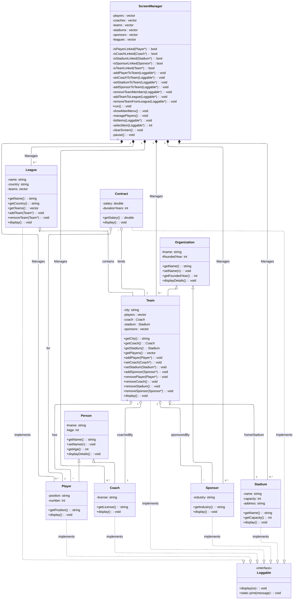

```mermaid
---
config:
  layout: elk
---
classDiagram
    direction TB

    class Loggable {
        <<interface>>
        +display(os): void
        +static print(message): void
    }
    
    class Person {
        #name: string
        #age: int
        +getName(): string
        +setName(n): void
        +getAge(): int
        +displayDetails(): void
    }

    class Organization {
        #name: string
        #foundedYear: int
        +getName(): string
        +setName(n): void
        +getFoundedYear(): int
        +displayDetails(): void
    }

    class Player {
        -position: string
        -number: int
        +getPosition(): string
        +display(): void
    }

    class Coach {
        -license: string
        +getLicense(): string
        +display(): void
    }

    class Team {
        -city: string
        -players : vector<Player*>
        -coach : Coach*
        -stadium : Stadium*
        -sponsors : vector<Sponsor*>

        +getCity(): string
        +getCoach(): Coach*
        +getStadium(): Stadium*
        +getPlayers(): vector<Player*>

        +addPlayer(Player*): void
        +setCoach(Coach*): void
        +setStadium(Stadium*): void
        +addSponsor(Sponsor*): void

        +removePlayer(Player*): void
        +removeCoach(): void
        +removeStadium(): void
        +removeSponsor(Sponsor*): void

        +display(): void
    }

    class Sponsor {
        -industry: string
        +getIndustry(): string
        +display(): void
    }
    
    class Stadium {
        -name: string
        -capacity: int
        -address: string
        +getName(): string
        +getCapacity(): int
        +display(): void
    }

    class League {
        -name: string
        -country: string
        -teams: vector<Team*>

        +getName(): string
        +getCountry(): string
        +getTeams(): vector<Team*>

        +addTeam(Team*): void
        +removeTeam(Team*): void

        +display(): void
    }

    class Contract {
        -salary: double
        -durationYears: int
        +getSalary(): double
        +display(): void
    }
    
    class ScreenManager {
        -players : vector<PlayerPtr>
        -coaches : vector<CoachPtr>
        -teams : vector<TeamPtr>
        -stadiums : vector<StadiumPtr>
        -sponsors : vector<SponsorsPtr>
        -leagues : vector<LeaguesPtr>
        
        -isPlayerLinked(Player*): bool
        -isCoachLinked(Coach*): bool
        -isStadiumLinked(Stadium*): bool
        -isSponsorLinked(Sponsor*): bool
        -isTeamLinked(Team*): bool

        -addPlayerToTeam(Loggable*): void
        -setCoachToTeam(Loggable*): void
        -setStadiumToTeam(Loggable*): void
        -addSponsorToTeam(Loggable*): void
        -removeTeamMembers(Loggable*): void
        -addTeamToLeague(Loggable*): void
        -removeTeamFromLeague(Loggable*): void
        
        +run(): void
        -showMainMenu(): void
        -managePlayers(): void
        -listItems(Loggable*): void
        -selectItem(Loggable*): int
        -clearScreen(): void
        -pause(): void
    }


    Person <|-- Player
    Player ..|> Loggable : implements
    
    Person <|-- Coach
    Coach ..|> Loggable : implements
    
    Organization <|-- Team
    Team ..|> Loggable : implements
    
    Organization <|-- Sponsor
    Sponsor ..|> Loggable : implements
    
    League ..|> Loggable : implements
    Stadium ..|> Loggable : implements
    Contract ..|> Loggable : implements

    ScreenManager "1" *-- "0..*" Player : Manages
    ScreenManager "1" *-- "0..*" Coach : Manages
    ScreenManager "1" *-- "0..*" Team : Manages
    ScreenManager "1" *-- "0..*" Stadium : Manages
    ScreenManager "1" *-- "0..*" League : Manages
    ScreenManager "1" *-- "0..*" Sponsor : Manages
    
    Team "1" o-- "*" Player : has
    Team "1" o-- "1" Coach : coachedBy
    Team "1" o-- "1" Stadium : homeStadium
    League "1" o-- "*" Team : contains
    Contract "*" o-- "1" Player : for
    Contract "*" o-- "1" Team : binds
    Team "1" o-- "*" Sponsor : sponsoredBy
```
