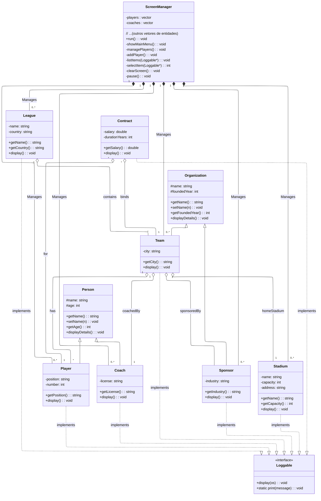

```mermaid
---
config:
  layout: elk
---
classDiagram
    direction TB

    class Loggable {
        <<interface>>
        +display(os): void
        +static print(message): void
    }
    
    class Person {
        #name: string
        #age: int
        +getName(): string
        +setName(n): void
        +getAge(): int
        +displayDetails(): void
    }

    class Organization {
        #name: string
        #foundedYear: int
        +getName(): string
        +setName(n): void
        +getFoundedYear(): int
        +displayDetails(): void
    }

    class Player {
        -position: string
        -number: int
        +getPosition(): string
        +display(): void
    }

    class Coach {
        -license: string
        +getLicense(): string
        +display(): void
    }

    class Team {
        -city: string
        +getCity(): string
        +display(): void
    }

    class Sponsor {
        -industry: string
        +getIndustry(): string
        +display(): void
    }
    
    class Stadium {
        -name: string
        -capacity: int
        -address: string
        +getName(): string
        +getCapacity(): int
        +display(): void
    }

    class League {
        -name: string
        -country: string
        +getName(): string
        +getCountry(): string
        +display(): void
    }

    class Contract {
        -salary: double
        -durationYears: int
        +getSalary(): double
        +display(): void
    }
    
    class ScreenManager {
        -players : vector<PlayerPtr>
        -coaches : vector<CoachPtr>
        // ... (outros vetores de entidades)
        +run(): void
        -showMainMenu(): void
        -managePlayers(): void
        -addPlayer(): void
        -listItems(Loggable*): void
        -selectItem(Loggable*): int
        -clearScreen(): void
        -pause(): void
    }


    Person <|-- Player
    Player ..|> Loggable : implements
    
    Person <|-- Coach
    Coach ..|> Loggable : implements
    
    Organization <|-- Team
    Team ..|> Loggable : implements
    
    Organization <|-- Sponsor
    Sponsor ..|> Loggable : implements
    
    League ..|> Loggable : implements
    Stadium ..|> Loggable : implements
    Contract ..|> Loggable : implements

    ScreenManager "1" *-- "0..*" Player : Manages
    ScreenManager "1" *-- "0..*" Coach : Manages
    ScreenManager "1" *-- "0..*" Team : Manages
    ScreenManager "1" *-- "0..*" Stadium : Manages
    ScreenManager "1" *-- "0..*" League : Manages
    ScreenManager "1" *-- "0..*" Sponsor : Manages
    
    Team "1" o-- "*" Player : has
    Team "1" o-- "1" Coach : coachedBy
    Team "1" o-- "1" Stadium : homeStadium
    League "1" o-- "*" Team : contains
    Contract "*" o-- "1" Player : for
    Contract "*" o-- "1" Team : binds
    Team "" o-- "" Sponsor : sponsoredBy
```
